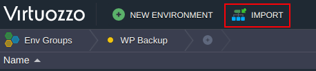
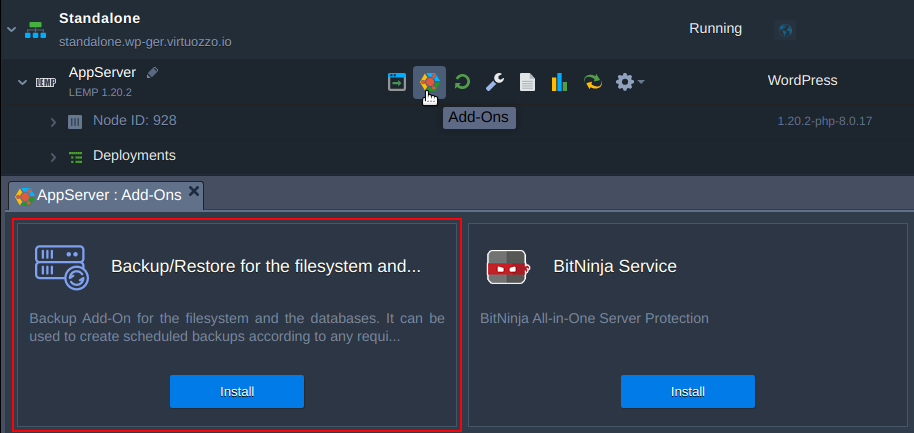
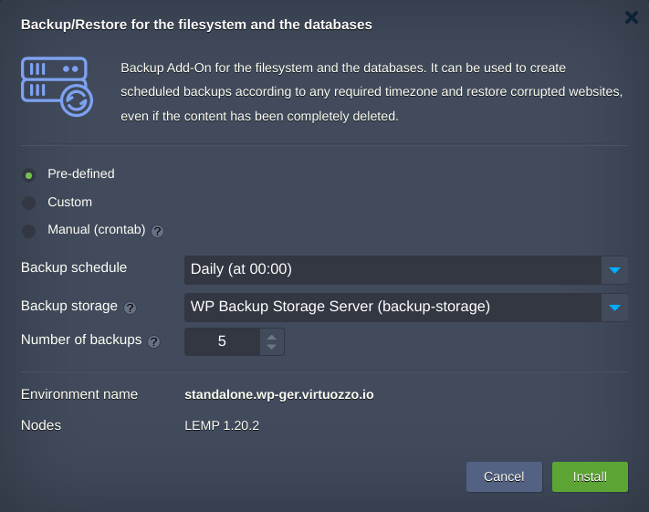
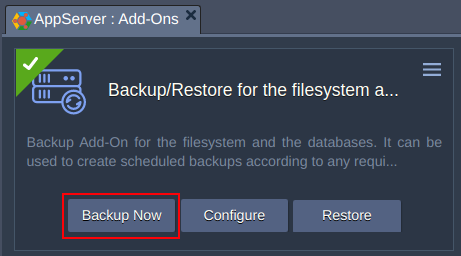
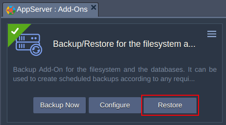
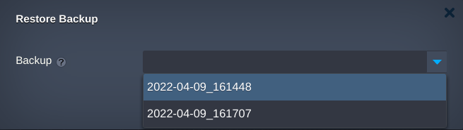
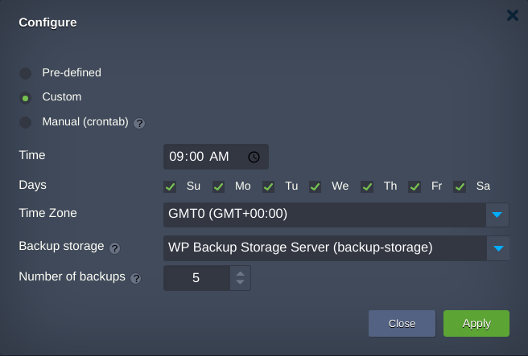

  

# Backup Add-On

Backup Add-On is a solution that backups filesystem and database of a web application to [Backup Storage](https://docs.jelastic.com/shared-storage-container/) node within the Virtuozzo Application Platform. 
The list of supported web applications:

 - WordPress

As a backup software the [Restic](https://restic.net/) is used.

Restic is a program to make a security copy for free and fast. It is a secure, cross-platform, open source program written in the Go programming language.

Restic encrypts data using AES-256 and authenticates it using Poly1305-AES. Backing up is incremental process and is based on snapshotting of the specific directory or even the whole server that makes the process is really fast.

## How does the Backup Add-On Work

Backup Add-On can be installed on any Application Server node and works in tandem with [Backup Storage](https://github.com/jelastic-jps/backup-storage). They both have preinstalled Restic software, which do different functions.

The Restic on the Application node is used to obtain a list of backups available for the environment and to create/restore these backups.
On the backup storage node, the Restic is used to serve requests from Application's Restic instance providing information regarding storage and available backup snapshots for the environment the Backup Add-On is installed on. Thus the Application's Restic decides what backup/restore actions should be done.  

## Installation Process  

1. [Import](https://docs.jelastic.com/environment-import/) the [link of the manifest](https://raw.githubusercontent.com/jelastic-jps/backup-addon/main/backup.jps) within a dashboard of [Virtuozzo Application Platform for WordPress](https://docs.jelastic.com/virtuozzo-application-platform-for-wordpress/) 

 

 or invoke add-on installation within [Application server layer](https://docs.jelastic.com/paas-components-definition/#layer) addons

 

2. In the opened window, set up the **Backup schedule**, choose **Backup storage** and define **Number of backups** to be kept during backup files rotation.

 

3. When the installation is finished, you may create the first backup which is usually takes more time than the subsequent incremental backups. This can be done manually:

 

### Backup Flow

Backup action can be started automatically according to the predifened schedule or manually via Add-On's UI.
Once the backup action is invoked the following steps take place:  

 - Backup Storage is mounted via NFS4 to the Application node
 - Database dump is generated to the flat file
 - The backup snapshot is created
 - Backup snapshot comprises the database dump file and specific directory. Currently the most common used directory for the web applications: **/var/www/webroot/ROOT/**.

### Restoration Flow

Restore action can be started manually only via Add-On's UI.

 

Choose the required timestamp of the backup snapshot and restore it.

 

### Add-On Configuration

You may configure Add-On's parameters.

 

These are:  

 - Backup schedule
 - Number of backups to be kept
 - Backup storage environment

 

 